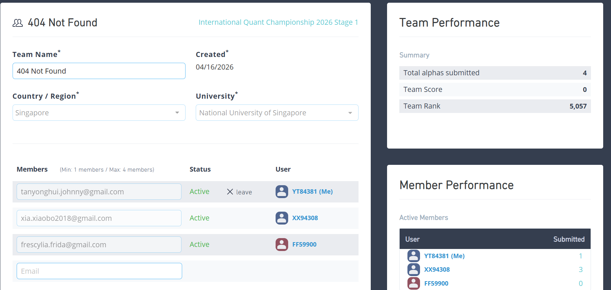

# Quant Research Workspace

This repository documents the workflow I used while competing in the 2026 WorldQuant BRAIN International Quant Championship (IQC). The project focuses on systematic alpha experimentation: generating hypotheses, testing formula-based signals in WorldQuant BRAIN, comparing results under fixed settings, and tracking confirmed winners instead of ad hoc tuning.



The screenshot above is included as proof of the competition dashboard and team-ranking result. This repo is best read as a technical experimentation project that demonstrates structured research, metric-driven iteration, and disciplined result tracking.

## What This Repo Is

This repo is a structured experimentation workspace for quantitative alpha research.

It is designed to help with:

- generating alpha family ideas
- testing one hypothesis at a time
- keeping settings fixed while comparing formulas
- logging confirmed results and avoiding mislabeled runs
- documenting major workflow changes and lessons learned

It is not a local backtesting engine and it does not submit directly to WorldQuant BRAIN.

## Current Strategy Direction

The strongest confirmed branch so far is:

```text
rank(-ts_delta(close, 1)) * rank(volume / ts_mean(volume, 100))
```

Interpretation:

- core signal: short-term reversal
- context filter: abnormal volume
- current lesson: reversal works better when current volume is unusual relative to a longer recent baseline

Recent pivots showed:

- volatility normalization was weaker than the plain reversal baseline
- volume conditioning improved the reversal branch
- continuation / momentum was rejected in this setup
- some new pivots were respectable, but did not beat the benchmark

## Repo Structure

- `readme.md`: project overview and current workflow summary
- `codex.md`: local operating rules for Codex in this repo
- `dev_doc.md`: exact run and sanity-test instructions
- `Quant_analyst.md`: optional quant-domain guidance
- `research/competition_notes.md`: competition workflow, screening rubric, and research priorities
- `research/alpha_ledger.csv`: log of tested alpha variants and their status
- `research/change_learning_log.md`: major repo changes with technical and simplified explanations
- `output/jupyter-notebook/iqc-stage1-research.ipynb`: main notebook used to stage ideas and preview ledger rows
- `image/ss.png`: screenshot used in this README

## Quick Start

Open PowerShell and run:

```powershell
cd "C:\Users\User\All my projects\Quant"
& ".\.venv\Scripts\python.exe" -m jupyter lab
```

Then:

1. open `output/jupyter-notebook/iqc-stage1-research.ipynb`
2. choose kernel `Quant (py313)` if prompted
3. run the notebook cells from top to bottom
4. test formulas manually in WorldQuant BRAIN
5. record confirmed results in `research/alpha_ledger.csv`

## Working Method

The repo follows a simple research loop:

1. pick one alpha family
2. change one meaningful thing at a time
3. keep simulation settings fixed during nearby comparisons
4. log the result clearly
5. stop dead branches quickly
6. branch into new ideas only after learning something from the current family

This is intentionally closer to disciplined experimentation than to brute-force tuning.

## Recommended Fixed Settings For Nearby Comparisons

Use one stable settings block when comparing neighboring formulas:

- Region: `USA`
- Universe: `TOP3000`
- Delay: `1`
- Neutralization: `Subindustry`
- Decay: `4`
- Truncation: `0.08`

Keep the remaining settings unchanged across a given comparison batch.

## Current Learning

Main takeaway so far:

- abnormal volume is the most useful recurring ingredient
- one-day reversal is stronger than the tested continuation branch
- not every "new idea" is better than the benchmark, so pivots should be evaluated against the best confirmed formula, not just the previous run

## Notes

- Use the README for orientation.
- Use `dev_doc.md` when you need exact commands.
- Use `competition_notes.md` and the notebook when actively testing ideas.
- Treat the ledger as the source of truth for what was actually tested.
